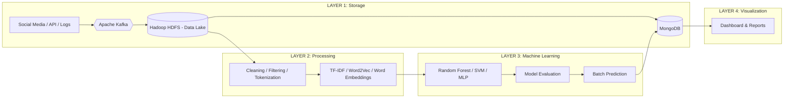

#  Sentiment Analysis & Social Media Trends — Big Data Pipeline

> **Hệ thống phân tích cảm xúc trên mạng xã hội** sử dụng kiến trúc phân lớp kết hợp Batch & Real-time Processing với Hadoop, Spark, Kafka, MongoDB và Machine Learning.

---

##  Mục lục

1. [Giới thiệu](#-giới-thiệu)
2. [Kiến trúc hệ thống 4 lớp](#-kiến-trúc-hệ-thống-4-lớp)
3. [Công nghệ sử dụng](#-công-nghệ-sử-dụng)
4. [Cấu trúc thư mục](#-cấu-trúc-thư-mục)
5. [Hướng dẫn cài đặt & Khởi chạy](#-hướng-dẫn-cài-đặt--khởi-chạy)
6. [Hướng dẫn chạy Pipeline theo từng Layer](#-hướng-dẫn-chạy-pipeline-theo-từng-layer)
7. [Monitoring & Dashboard](#-monitoring--dashboard)

---

##  Giới thiệu

Dự án xây dựng một **pipeline xử lý dữ liệu lớn toàn diện** cho bài toán phân tích cảm xúc (Sentiment Analysis) trên 1.6 triệu tweets từ tập dữ liệu **Sentiment140**. Hệ thống được thiết kế theo kiến trúc **4 lớp (4-Layer Architecture)** bao gồm:

- **Layer 1 — Storage**: Thu thập & lưu trữ dữ liệu phân tán trên HDFS + MongoDB.
- **Layer 2 — Processing**: Tiền xử lý & trích xuất đặc trưng bằng Apache Spark trên YARN.
- **Layer 3 — Machine Learning**: Huấn luyện, đánh giá, triển khai mô hình với MLOps.
- **Layer 4 — Visualization & Reporting**: Dashboard, biểu đồ, so sánh hiệu năng.

---

## 🏗 Kiến trúc hệ thống 4 lớp

```
┌─────────────────────────────────────────────────────────────────────────┐
│  LAYER 1: STORAGE LAYER                                                 │
│                                                                         │
│  Data Sources ──► Apache Kafka ──► Hadoop HDFS (Data Lake) ──► MongoDB  │
│  (Social Media,    (Streaming       (Raw Data,     (Feature     (Live    │
│   API, Logs,        Ingestion)       CSV/JSON)      Data)       Results, │
│   Database)                                                    Metadata)│
├─────────────────────────────────────────────────────────────────────────┤
│  LAYER 2: PROCESSING LAYER                                              │
│                                                                         │
│  Data Preprocessing (Spark)    Apache Spark on YARN    Feature Eng.     │
│  ┌──────┬──────────┬──────┐    Cluster (Distributed    ┌──────────────┐ │
│  │Clean │ Filter   │Token.│    Processing Engine)      │TF-IDF, W2Vec │ │
│  └──────┴──────────┴──────┘                            │Word Embedding│ │
│                                                        └──────────────┘ │
├─────────────────────────────────────────────────────────────────────────┤
│  LAYER 3: MACHINE LEARNING LAYER                                        │
│                                                                         │
│  Model Training         Model Evaluation       Model Deployment         │
│  ┌─────────────────┐    ┌────────────────┐     ┌──────────────────┐     │
│  │ Random Forest   │    │ Accuracy       │     │ REST API /       │     │
│  │ SVM             │──► │ Precision      │──►  │ Batch Prediction │──►  │
│  │ MLP (LSTM)      │    │ Recall         │     │                  │     │
│  │ + Hyperparam    │    │ F1 / AUC-ROC   │     │ Store to MongoDB │     │
│  │   Tuning (CV)   │    └────────────────┘     └──────────────────┘     │
│  └─────────────────┘                                                    │
│  MLOps: MLflow Tracking │ Model Registry │ Versioning                   │
├─────────────────────────────────────────────────────────────────────────┤
│  LAYER 4: VISUALIZATION & REPORTING LAYER                               │
│                                                                         │
│  A. Performance Metrics            B. Business Insights                 │
│  ┌──────────────────────┐          ┌─────────────────────────┐          │
│  │ Parallel vs Seq.     │          │ Sentiment Distribution  │          │
│  │ Benchmark            │          │ Sentiment Trend by Day  │          │
│  │ Model Comparison     │          │ Top 20 Words            │          │
│  └──────────────────────┘          └─────────────────────────┘          │
└─────────────────────────────────────────────────────────────────────────┘

──────► Batch / Micro-batch Flow
- - - ► Real-time Flow
[     ] Optional / Supporting Component
```

### Luồng dữ liệu (Data Flow)



---

## 🛠 Công nghệ sử dụng

| Layer | Công nghệ | Vai trò |
|---|---|---|
| **Layer 1: Storage** | Hadoop HDFS 3.2 | Data Lake — lưu trữ phân tán dữ liệu thô (Raw), đã làm sạch (Cleaned), đặc trưng (Feature) |
| | Apache Kafka 7.5 | Streaming Ingestion — hàng đợi tin nhắn thời gian thực |
| | MongoDB 7.0 | Real-time NoSQL — lưu kết quả dự đoán, điểm số, metadata |
| **Layer 2: Processing** | Apache Spark 3.5 + YARN | Distributed Processing Engine — xử lý song song trên cluster |
| | PySpark MLlib | Tiền xử lý dữ liệu, trích xuất đặc trưng TF-IDF, Word2Vec |
| **Layer 3: ML** | Random Forest, SVM, MLP | Huấn luyện mô hình phân loại cảm xúc |
| | CrossValidator | Hyperparameter Tuning với k-fold Cross-Validation |
| | MLflow | MLOps — Tracking, Model Registry, Versioning |
| **Layer 4: Viz** | FastAPI | REST API phục vụ kết quả |
| | Web Dashboard | Biểu đồ sentiment, benchmark, model comparison |
| | Jupyter Notebook | Phân tích tương tác & báo cáo |
| **Orchestration** | Apache Airflow 2.8 | Điều phối DAGs, lập lịch pipeline tự động |

---

##  Cấu trúc thư mục

```
BM-Rua/
├── docker-compose.yml              # Khởi động toàn bộ hệ thống
├── run_pipeline.sh                 # Script chạy tự động toàn bộ pipeline
│
├── scripts/
│   ├── download_data.sh            # Tải tập dữ liệu Sentiment140
│   ├── visualization.py            # Tạo biểu đồ Layer 4
│   ├── hadoop/
│   │   ├── upload_hdfs.sh          # Đẩy dữ liệu lên HDFS
│   │   └── hadoop_streaming.sh     # Demo Hadoop Streaming
│   ├── kafka/
│   │   └── producer.py             # Kafka producer — stream dữ liệu real-time
│   └── spark/
│       ├── preprocessing.py        # Layer 2: Cleaning, Filtering, Tokenization
│       ├── feature_extraction.py   # Layer 2: TF-IDF, Word2Vec, N-gram
│       ├── ml_training.py          # Layer 3: RF, SVM, MLP + Tuning + MLflow
│       ├── streaming_sentiment.py  # Real-time: Spark Structured Streaming
│       ├── benchmark.py            # Layer 4A: Parallel vs Sequential
│       └── distributed_processing.py # Layer 4A: Demo xử lý phân tán
│
├── api/                            # FastAPI backend (REST API)
│   ├── main.py
│   └── Dockerfile
├── dashboard/                      # Web Dashboard (Layer 4B)
│   ├── app.py
│   ├── index.html
│   ├── script.js
│   └── style.css
├── airflow/                        # DAGs & config cho Airflow
├── data/                           # Thư mục dữ liệu local
│   └── raw/                        # Dữ liệu gốc Sentiment140
├── hadoop-config/                  # Cấu hình Hadoop
├── spark-config/                   # Cấu hình Spark
├── notebooks/                      # Jupyter notebooks
└── docs/                           # Tài liệu & output
```

---

##  Hướng dẫn cài đặt & Khởi chạy

### Yêu cầu tiên quyết

| Yêu cầu | Chi tiết |
|---|---|
| Docker & Docker Compose | Phiên bản mới nhất |
| RAM | Tối thiểu **8 GB** (đã tối ưu cho máy yếu) |
| Disk | Tối thiểu **10 GB** trống |
| OS | Windows (WSL 2), Linux, hoặc macOS |

### Khởi động hệ thống

```bash
# 1. Clone project và di chuyển vào thư mục
cd BM-Rua

# 2. Khởi động toàn bộ 12 services
docker-compose up -d

# 3. Đợi 2-3 phút cho tất cả service sẵn sàng
# Kiểm tra trạng thái:
docker-compose ps
```

Sau khi khởi động, các service sẽ chạy tại:

| Service | URL | Mô tả |
|---|---|---|
| Hadoop NameNode | http://localhost:9870 | HDFS Web UI |
| YARN ResourceManager | http://localhost:8088 | YARN Job Tracking |
| Spark Master | http://localhost:8080 | Spark Cluster UI |
| Jupyter Notebook | http://localhost:8888 | Notebook tương tác |
| Airflow | http://localhost:8081 | Pipeline Orchestration (`admin`/`admin`) |
| Sentiment API | http://localhost:8000/docs | FastAPI Swagger UI |
| Kafka | localhost:9092 | Message Broker |
| MongoDB | localhost:27017 | NoSQL Database |

---

##  Hướng dẫn chạy Pipeline theo từng Layer

> **Có 2 cách chạy:**
> - **Cách 1 (Tự động):** Chạy script `run_pipeline.sh` — thực thi toàn bộ pipeline từ Layer 1 → 4.
> - **Cách 2 (Thủ công):** Chạy từng lệnh theo từng Layer như hướng dẫn bên dưới.

###  Cách 1: Chạy tự động toàn bộ

```bash
bash run_pipeline.sh
```

Script sẽ hỏi xác nhận từng bước trước khi chạy.

---

###  Cách 2: Chạy thủ công từng Layer

---
###  LAYER 1: Storage Layer
> **Mục tiêu:** Thu thập dữ liệu → Đẩy vào HDFS (Data Lake) → Sẵn sàng cho xử lý.

#### Bước 1.1: Upload dữ liệu lên HDFS
> Dữ liệu Sentiment140 (~1.6 triệu tweets) đã có sẵn tại `data/raw/sentiment140_full.csv`.

```bash
bash scripts/hadoop/upload_hdfs.sh
```
> Đẩy dữ liệu từ thư mục `data/raw/` vào HDFS tại `/sentiment/raw/` — đây là **Data Lake** theo sơ đồ.

#### Bước 1.2 (Tuỳ chọn): Kiểm tra dữ liệu trên HDFS
```bash
docker exec namenode hdfs dfs -ls /sentiment/raw/
docker exec namenode hdfs dfs -du -h /sentiment/
```

---

###  LAYER 2: Processing Layer
> **Mục tiêu:** Tiền xử lý dữ liệu (Cleaning, Filtering, Tokenization) → Trích xuất đặc trưng (TF-IDF, Word2Vec) trên **Apache Spark + YARN Cluster**.

#### Bước 2.1: Data Preprocessing (Spark)
```bash
docker exec spark-master spark-submit \
    --master spark://spark-master:7077 \
    --conf spark.executor.memory=1g \
    --conf spark.executor.cores=1 \
    /data/scripts/spark/preprocessing.py
```
> **Cleaning** → loại bỏ URL, mention, ký tự đặc biệt.
> **Filtering** → loại stop words, từ ngắn.
> **Tokenization** → tách từ, stemming.
>
> Output: `/sentiment/processed/preprocessed` (Parquet trên HDFS)

#### Bước 2.2: Feature Engineering
```bash
docker exec spark-master spark-submit \
    --master spark://spark-master:7077 \
    /data/scripts/spark/feature_extraction.py
```
> **TF-IDF** (50,000 features) — Term Frequency–Inverse Document Frequency.
> **Word2Vec** (100 dimensions) — Dense word embeddings.
> **N-gram** (bigrams) — Chuỗi từ liên tiếp.
>
> Output: `/sentiment/processed/features_train` & `features_test` (Parquet)

---

###  LAYER 3: Machine Learning Layer
> **Mục tiêu:** Huấn luyện mô hình → Đánh giá → Triển khai → Lưu kết quả vào MongoDB.

#### Bước 3.1: Model Training & Evaluation
```bash
docker exec spark-master spark-submit \
    --master spark://spark-master:7077 \
    /data/scripts/spark/ml_training.py
```

Script này thực hiện toàn bộ quy trình Layer 3:

| Bước | Chi tiết |
|---|---|
| **Algorithm Selection** | Random Forest, Linear SVM, MLP (LSTM proxy) |
| **Hyperparameter Tuning** | CrossValidator với 3-fold CV + ParamGridBuilder |
| **Model Evaluation** | Accuracy, Precision, Recall, F1-score, AUC-ROC |
| **Model Registry** | Lưu model lên HDFS `/sentiment/models/` |
| **MLflow Tracking** | Log metrics, params, training time (nếu MLflow khả dụng) |
| **Batch Prediction** | Dự đoán trên tập test → lưu Parquet |
| **Store to MongoDB** | `model_metrics`, `predictions`, `model_metadata` collections |

#### Bước 3.2 (Tuỳ chọn): Kiểm tra kết quả trên MongoDB
```bash
docker exec mongodb mongosh --eval "
  use sentiment_db;
  print('=== Model Metrics ===');
  db.model_metrics.find().forEach(printjson);
  print('=== Best Model ===');
  db.model_metadata.findOne();
"
```

---

###  LAYER 3 (Bổ sung): Real-time Streaming
> **Mục tiêu:** Stream dữ liệu real-time qua Kafka → Spark Streaming → MongoDB.

Mở **2 terminal** riêng biệt:

**Terminal 1 — Kafka Producer** (đẩy dữ liệu vào Kafka):
```bash
docker exec -it kafka python3 /data/scripts/kafka/producer.py
```

**Terminal 2 — Spark Structured Streaming** (xử lý real-time):
```bash
docker exec -it spark-master spark-submit --packages org.apache.spark:spark-sql-kafka-0-10_2.12:3.5.3 /data/scripts/spark/streaming_sentiment.py
```

---

###  LAYER 4: Visualization & Reporting Layer
> **Mục tiêu:** Hiển thị kết quả — Performance Metrics (cho Engineers) & Business Insights (cho Analysts).

#### Bước 4.1: Benchmark — Parallel vs Sequential (Performance Metrics)
```bash
docker exec spark-master spark-submit \
    --master spark://spark-master:7077 \
    /data/scripts/spark/benchmark.py
```
> So sánh thời gian xử lý và throughput giữa:
> - Sequential (Single CPU)
> - Parallel (PySpark Cluster)

#### Bước 4.2: Distributed Processing Demo
```bash
docker exec spark-master spark-submit \
    --master spark://spark-master:7077 \
    /data/scripts/spark/distributed_processing.py
```

#### Bước 4.3: Tạo biểu đồ trực quan (Visualization)
```bash
python3 scripts/visualization.py
```
> Tạo các biểu đồ:
> - **Model Performance Comparison** (Accuracy, Precision, Recall, F1, AUC-ROC)
> - **Sentiment Distribution** (Negative vs Positive)
> - **Sentiment Trend Over Time** (Aggregated by Day)
> - **Top 20 Words** (Từ phổ biến nhất)
> - **Parallel vs Sequential Benchmark** (Processing Time & Throughput)

#### Bước 4.4: Truy cập Dashboard & API
- **API Swagger UI:** [http://localhost:8000/docs](http://localhost:8000/docs)
  - `GET /metrics` — Kết quả đánh giá mô hình (Random Forest, SVM, MLP)
  - `GET /trends` — Xu hướng cảm xúc theo thời gian
  - `GET /recent-predictions` — Các dự đoán mới nhất
- **Jupyter Notebook:** [http://localhost:8888](http://localhost:8888) — Phân tích tương tác

---

##  Monitoring & Dashboard

### Service Monitoring

| Service | URL | Mục đích |
|---|---|---|
| **Spark Master UI** | http://localhost:8080 | Theo dõi jobs, workers, executors |
| **Hadoop NameNode** | http://localhost:9870 | Kiểm tra HDFS, dung lượng, blocks |
| **YARN ResourceManager** | http://localhost:8088 | Theo dõi YARN applications |
| **Airflow UI** | http://localhost:8081 | Quản lý DAGs, lịch sử chạy |
| **API Docs** | http://localhost:8000/docs | Swagger UI — test API endpoints |
| **Jupyter** | http://localhost:8888 | Notebook tương tác |

### Kiểm tra sức khỏe hệ thống

```bash
# Xem trạng thái tất cả containers
docker-compose ps

# Xem logs của một service cụ thể
docker-compose logs -f spark-master
docker-compose logs -f kafka

# Kiểm tra HDFS
docker exec namenode hdfs dfs -df -h

# Kiểm tra MongoDB
docker exec mongodb mongosh --eval "db.adminCommand('ping')"
```

### Dừng hệ thống

```bash
# Dừng tất cả services (giữ dữ liệu)
docker-compose down

# Dừng và xóa toàn bộ volumes (xóa sạch dữ liệu)
docker-compose down -v
```

---
