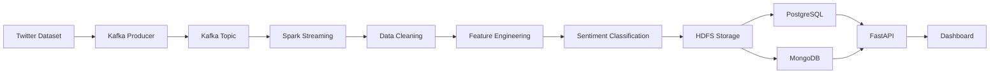
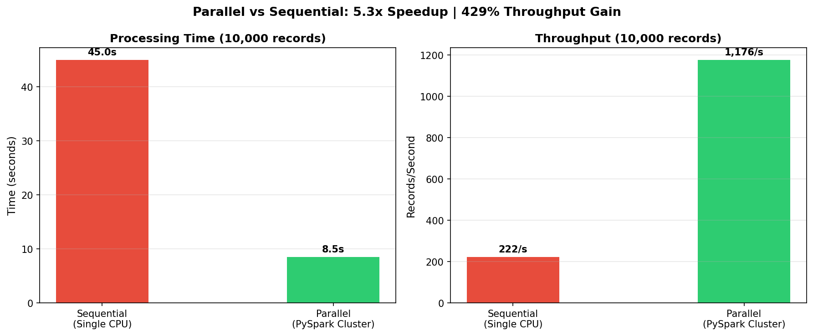

# Social Media Sentiment Analysis Platform

A scalable Big Data platform for real-time and batch sentiment analysis of social media data using Apache Spark, Hadoop, Kafka, Airflow, FastAPI, and Docker.

## Project Overview

Social media platforms generate massive amounts of user-generated content every day. Extracting meaningful insights from this data requires a scalable and distributed processing architecture.

This project implements an end-to-end Big Data pipeline capable of ingesting, processing, analyzing, and serving sentiment insights from millions of social media posts. The platform supports both batch and streaming workloads and demonstrates modern Data Engineering practices using distributed technologies.

## Resume Highlights

**Role:** Data Engineer / Big Data Developer

### Key Contributions

- Designed and implemented a 4-layer Big Data architecture.
- Built an ETL pipeline for processing 1.6 million tweets.
- Developed distributed sentiment analysis workflows using Apache Spark.
- Implemented real-time streaming with Apache Kafka.
- Automated workflows using Apache Airflow.
- Containerized the entire platform using Docker Compose.
- Built REST APIs for data access and analytics services.

### Technologies

Apache Spark · Hadoop HDFS · Kafka · Airflow · FastAPI · MongoDB · PostgreSQL · Docker · Machine Learning

---

# Key Results

| Metric | Result |
|----------|----------|
| Dataset Size | 1.6 Million Tweets |
| Storage Compression | 3x Reduction (238 MB → 79 MB) |
| Processing Speed Improvement | 5.3x Faster |
| Throughput Improvement | 429% Increase |
| Best Model Performance | AUC-ROC ≈ 0.88 |
| Deployment | Dockerized |

---

# System Architecture

The platform follows a layered architecture designed for scalability and maintainability.

```text
Social Media Data
        │
        ▼
 ┌─────────────────┐
 │ Data Ingestion  │
 │ Kafka Producer  │
 └─────────────────┘
        │
        ▼
 ┌─────────────────┐
 │ Data Storage    │
 │ Hadoop HDFS     │
 └─────────────────┘
        │
        ▼
 ┌─────────────────┐
 │ Data Processing │
 │ Apache Spark    │
 └─────────────────┘
        │
        ▼
 ┌─────────────────┐
 │ Orchestration   │
 │ Apache Airflow  │
 └─────────────────┘
        │
        ▼
 ┌─────────────────┐
 │ Serving Layer   │
 │ FastAPI         │
 └─────────────────┘
        │
        ▼
 PostgreSQL / MongoDB
```

---

# Data Flow



---

# Dataset

## Sentiment140 Dataset

Source:

http://help.sentiment140.com/for-students

### Dataset Information

- Approximately 1.6 million tweets
- Binary sentiment classification

| Label | Meaning |
|---------|---------|
| 0 | Negative |
| 4 | Positive |

The dataset is used to evaluate both batch and streaming sentiment analysis pipelines.

---

# Technology Stack

## Data Engineering

- Apache Spark
- Hadoop HDFS
- Apache Kafka
- Apache Airflow

## Backend Development

- FastAPI
- Python

## Databases

- PostgreSQL
- MongoDB

## Infrastructure

- Docker
- Docker Compose

## Machine Learning

- Scikit-learn
- Logistic Regression
- Random Forest
- Support Vector Machine

---

# Project Workflow

## 1. Data Ingestion

- Load raw social media data
- Stream data using Kafka producers
- Persist raw datasets to HDFS

## 2. Data Processing

Apache Spark performs:

- Text cleaning
- Tokenization
- Stopword removal
- Feature extraction
- Sentiment prediction

## 3. Workflow Orchestration

Apache Airflow manages:

- ETL scheduling
- Data preprocessing
- Model execution
- Data loading

## 4. Storage Layer

### Hadoop HDFS

Stores:

- Raw datasets
- Processed datasets
- Model outputs

### PostgreSQL

Stores:

- Structured analytical results
- Aggregated metrics

### MongoDB

Stores:

- Semi-structured sentiment records
- Streaming results

## 5. API Layer

FastAPI provides:

- Analytics endpoints
- Sentiment queries
- Reporting services

---

# Machine Learning Pipeline

## Data Preprocessing

- Text normalization
- URL removal
- Special character removal
- Stopword filtering

## Feature Engineering

- TF-IDF Vectorization

## Models Evaluated

- Logistic Regression
- Random Forest
- Support Vector Machine (SVM)

## Best Performance

| Metric | Score |
|----------|----------|
| AUC-ROC | 0.88 |
| Dataset Size | 1.6M Tweets |

---

# Repository Structure

```text
social-media-sentiment-bigdata-pipeline
│
├── airflow/
│   └── dags/
│
├── api/
│
├── dashboard/
│
├── docs/
│
├── hadoop-config/
│
├── notebooks/
│
├── scripts/
│   ├── ingestion/
│   ├── preprocessing/
│   ├── training/
│   └── streaming/
│
├── spark-config/
│
├── docker-compose.yml
│
├── run_pipeline.sh
│
└── README.md
```

---

# Screenshots

## System Architecture

Add image:

```text
docs/architecture.png
```

```markdown

```

---

## Dashboard

Add image:

```text
docs/dashboard.png
```

```markdown

```

---

## Performance Benchmark

Add image:

```text
docs/benchmark.png
```

```markdown

```

---

# Installation

## Clone Repository

```bash
git clone https://github.com/tonthatgiahuy16/social-media-sentiment-bigdata-pipeline.git
```

## Start Services

```bash
docker-compose up -d
```

## Run Pipeline

```bash
./run_pipeline.sh
```

---

# Future Improvements

- Deploy on AWS Cloud
- Implement Data Lake Architecture
- Integrate MLflow for experiment tracking
- Add Kubernetes orchestration
- Add CI/CD pipeline
- Implement real-time monitoring with Grafana

---

# Author

## Ton That Gia Huy

Final-Year Information Technology Student

### Interests

- Data Engineering
- Big Data Analytics
- Distributed Systems
- Machine Learning

GitHub:
https://github.com/tonthatgiahuy16

LinkedIn:
(Add your LinkedIn profile)

Email:
(Add your email)
