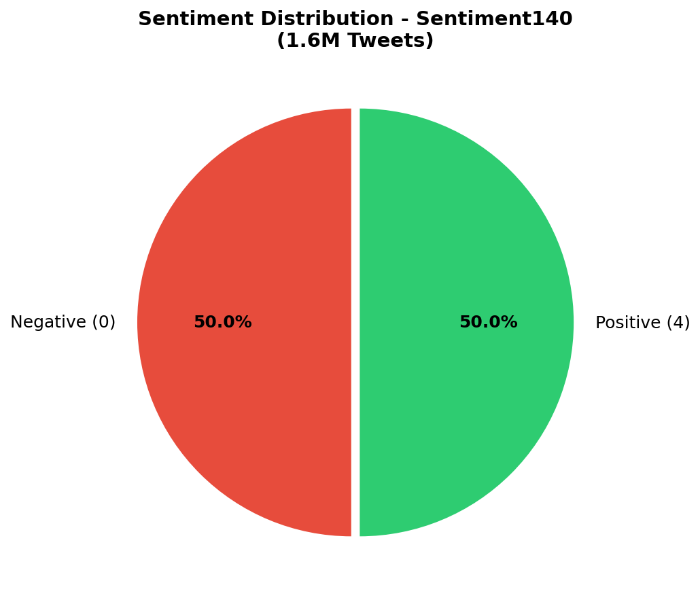
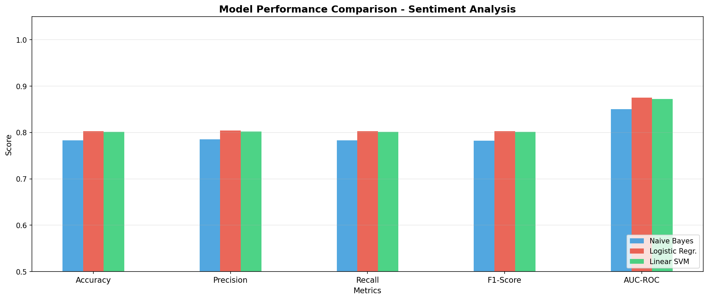
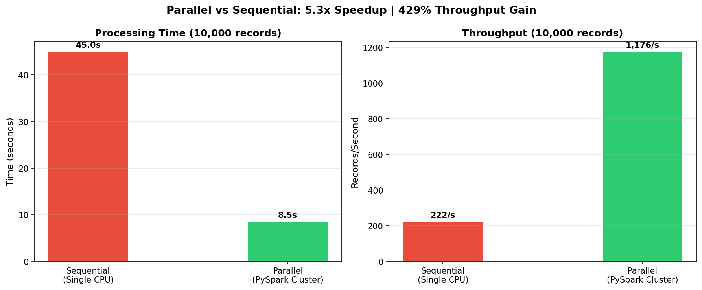

# Social Media Sentiment Big Data Pipeline

> A coursework prototype for exploring batch processing and simulated streaming with Spark, HDFS, Kafka, FastAPI, MongoDB, and Docker Compose.

This repository documents a local learning project built around the Sentiment140 dataset. The strongest part of the project is the batch workflow: storing raw data in HDFS, transforming it with PySpark, creating text features, training Spark ML models, and exposing saved results through an API.

The repository also contains a Kafka and Spark Structured Streaming demo. That path currently uses synthetic messages and rule-based sentiment labels; it should not be interpreted as a production social-media feed or a deployed ML inference service.

## Project status

| Area | Current state |
| --- | --- |
| Batch ingestion and HDFS storage | Implemented |
| PySpark preprocessing and feature extraction | Implemented |
| Spark ML training and batch prediction | Implemented as a local coursework workflow |
| FastAPI endpoints backed by MongoDB | Implemented |
| Kafka and Spark streaming | Working demonstration with synthetic input |
| Airflow orchestration | Placeholder DAG; not yet connected to the Spark jobs |
| PostgreSQL | Used for Airflow metadata, not application analytics |
| Automated tests and CI/CD | Not implemented |
| Cloud deployment and monitoring | Not implemented |

## What the project contains

### Batch workflow

~~~text
Sentiment140 CSV
    -> HDFS raw storage
    -> PySpark cleaning and tokenization
    -> Parquet datasets
    -> TF-IDF / Word2Vec feature generation
    -> Spark ML training and evaluation
    -> HDFS model outputs and MongoDB result collections
    -> FastAPI analytics endpoints
~~~

The batch scripts cover:

- Loading approximately 1.6 million Sentiment140 records.
- Cleaning URLs, mentions, repeated characters, and stopwords.
- Creating partitioned Parquet outputs.
- Generating TF-IDF, Word2Vec, and n-gram features.
- Comparing Random Forest, Linear SVM, and Multilayer Perceptron models on sampled training data.
- Saving model metadata, metrics, and a limited set of predictions for downstream access.

### Streaming demonstration

~~~text
Synthetic tweet producer
    -> Kafka topic
    -> Spark Structured Streaming
    -> Rule-based sentiment function
    -> MongoDB predictions
~~~

The producer replays a small built-in set of example messages. The streaming consumer demonstrates Kafka-to-Spark-to-MongoDB data movement, but it does not yet load the trained batch model.

### Local runner and Airflow

The interactive **run_pipeline.sh** script can start the environment and invoke the HDFS, Spark, training, benchmark, and visualization scripts.

An Airflow DAG is included to demonstrate task ordering and scheduling concepts. Its current tasks use echo and sleep commands; wiring it to real Spark submissions remains future work.

## Recorded coursework results

The following measurements were recorded during the original local coursework run and are retained as project evidence:

| Measurement | Recorded result |
| --- | --- |
| Input data | Approximately 1.6 million tweets |
| Raw CSV to partitioned Parquet | 238 MB to 79 MB |
| Sequential throughput | 222 records/second |
| PySpark throughput | 1,176 records/second |
| Reported model AUC-ROC | Approximately 0.88 |

These are environment-specific observations, not universal performance claims. The current benchmark script does not yet guarantee identical work and record counts across both execution paths. A stronger benchmark would persist raw logs, machine specifications, dataset counts, and repeated runs.

## Visual outputs

### Sentiment distribution

  

### Model comparison

  

### Local parallel-processing benchmark

  

## Repository structure

~~~text
social-media-sentiment-bigdata-pipeline/
├── airflow/
│   ├── airflow.cfg
│   └── dags/
│       └── sentiment_pipeline.py
├── api/
│   ├── Dockerfile
│   └── main.py
├── dashboard/
│   ├── app.py
│   ├── index.html
│   ├── script.js
│   └── style.css
├── docs/
│   ├── assets/
│   ├── HUONG_DAN_WINDOWS.md
│   └── report_summary.md
├── hadoop-config/
├── notebooks/
│   └── sentiment_pipeline.ipynb
├── scripts/
│   ├── hadoop/
│   ├── kafka/
│   ├── spark/
│   ├── download_data.sh
│   └── visualization.py
├── spark-config/
├── docker-compose.yml
└── run_pipeline.sh
~~~

## Run locally

### Requirements

- Docker Desktop or Docker Engine with Docker Compose.
- Git Bash, WSL, or a Linux/macOS shell for the shell scripts.
- Kaggle CLI credentials are recommended for downloading Sentiment140.
- Enough local memory for the Hadoop, Spark, Kafka, Airflow, database, and API services.

### 1. Clone the repository

~~~bash
git clone https://github.com/tonthatgiahuy16/social-media-sentiment-bigdata-pipeline.git
cd social-media-sentiment-bigdata-pipeline
~~~

### 2. Download the dataset

The recommended source is the Sentiment140 dataset on Kaggle:

https://www.kaggle.com/datasets/kazanova/sentiment140

After downloading, place the CSV at:

~~~text
data/raw/sentiment140_full.csv
~~~

The fallback URL in **scripts/download_data.sh** may be unavailable; prefer the Kaggle CLI or a manual download.

### 3. Start the local services

~~~bash
docker compose up -d
~~~

Docker Compose declares Hadoop/YARN, Spark, Kafka/Zookeeper, Airflow, MongoDB, PostgreSQL, Jupyter, and FastAPI services. Airflow initialization is a one-time job, so the number of running containers may differ from the number of declared services.

### 4. Run the interactive batch workflow

On Linux, macOS, Git Bash, or WSL:

~~~bash
chmod +x run_pipeline.sh
./run_pipeline.sh
~~~

From Windows PowerShell, run the script through WSL or open the repository in Git Bash. PowerShell does not execute a Bash script directly with **.\run_pipeline.sh**.

### 5. Inspect the services

- HDFS NameNode: http://localhost:9870
- YARN ResourceManager: http://localhost:8088
- Spark Master: http://localhost:8080
- Airflow: http://localhost:8081
- FastAPI documentation: http://localhost:8000/docs
- Jupyter: http://localhost:8888

## Known limitations

- The Airflow DAG is not connected to the implemented Spark scripts.
- Streaming uses generated sample messages and rule-based sentiment rather than the trained model.
- The dashboard prediction route contains demonstration logic.
- PostgreSQL currently supports Airflow metadata; application results are served from MongoDB.
- The benchmark needs an equivalent workload, repeated runs, and saved raw evidence.
- There is no automated test suite, CI/CD pipeline, cloud deployment, authentication, or production monitoring.
- The repository is designed for local coursework and requires substantial Docker resources.

## Next engineering steps

1. Replace placeholder Airflow tasks with SparkSubmitOperator jobs and explicit data dependencies.
2. Replay records from the source dataset through Kafka and load the trained model in the streaming path.
3. Add automated tests for preprocessing, APIs, and pipeline contracts.
4. Rework the benchmark so sequential and Spark implementations process identical inputs.
5. Save benchmark metadata and outputs as reproducible artifacts.
6. Add health checks, structured logging, and CI for the smaller testable components.

## Author

**Tôn Thất Gia Huy**  
Final-year Data Science student interested in Backend and Data Engineering roles.

- [GitHub](https://github.com/tonthatgiahuy16)
- [LinkedIn](https://www.linkedin.com/in/ton-that-gia-huy/)
- [Portfolio](https://tonthatgiahuy16.github.io)
